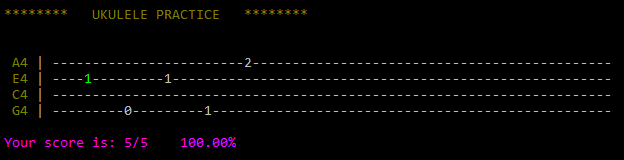

# Practice Strumming Notes on the Ukulele

## Description
This is a script that generates random tabs on the ukulele for practice. To run the script:
```
python run_ukulele_practice.py --instrument ukulele --speed 50 --tuning 0 --tries 50
```
* ```instrument```: ukulele (no other musical instruments supported yet)
* ```speed```: set the speed for how fast the tabs are generated
* ```tuning```: +/- half-steps (default: ```0```)
* ```tries```: set the number of notes that are generated for practice

Preview:



##Instructions
* Follow the note in green and strum the note on the ukulele
* If the note is correct, the score is incremented and the next note is displayed
* If the note is incorrect, keep trying until time-out after which the next note is displayed 
